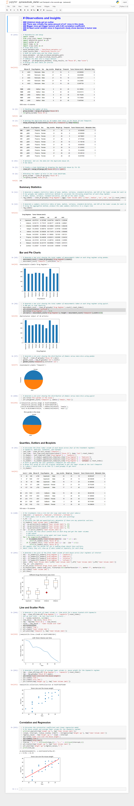

# Matplotlib Homework - The Power of Plots
# Observations and Insights 

### Infubinol study got an outlier.
### There was virtualy the same amount of m/f  mice in this study
### Bigger mice got bigger tumors with 0.85 correlation coefficient
### At least some random mice in Capomulin study show decrese in tumor size
 
Below is the solution in notebook, the way it looked on my desktop:

